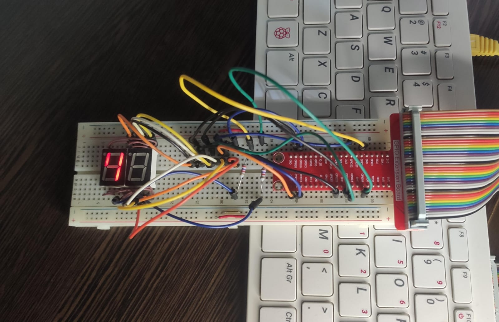

<h1 align="center">
    GPIO
</h1>

On Raspberry Pi, when accessing GPIOs through the old sysfs interface (`/sys/class/gpio`), each GPIO controller (gpiochip) has a base number.  
The sysfs GPIO number is calculated as:

```sh
sysfs_gpio_number = gpiochip_base + pin_number
```

You can find the base number for your board by running:

```sh
cat /sys/class/gpio/gpiochip*/base
```

For example, on a Raspberry Pi 4, the main controller `pinctrl-bcm2711` has a base of 512, so BCM pin 4 appears as sysfs GPIO 516.

To determine the base, follow these steps.
Note that `gpiochip0` is linked to `pinctrl-bcm2711` and that `gpiochip512` has `pinctrl-bcm2711` as its label:

```sh
$ gpiodetect
  gpiochip0 [pinctrl-bcm2711] (58 lines)
  gpiochip1 [raspberrypi-exp-gpio] (8 lines)
$ cat /sys/class/gpio/gpiochip512/label 
  pinctrl-bcm2711
$ cat /sys/class/gpio/gpiochip512/base
  512
```

### What

This kernel driver creates an interface to control a 7-segment display.
It is intended for a **common cathode** display — the logic must be inverted if using a common anode.

There are some `#define` values at the top of the source code to adjust the digit mappings based on your wiring. The cathode is connected to pin 17.

### How

The easiest way to use the driver is to run the script:

```sh
./init_mod.sh mount
```

This compiles and loads the module, then creates a device file linked to the driver with `mknod`.

To send a digit to the display, write directly to the device file:

```sh
echo 4 > /dev/gpio_7seg
```



To remove the module and delete the device file:

```sh
./init_mod.sh clean
```

## Extra Notes

* Raspberry Pi OS includes some useful commands to interact with GPIOs and get information:

  * `pinout` – Shows the pinout of the board
  * `gpiodetect` – Lists GPIO chips and their labels
  * `pinctrl` – Displays pin control configuration
