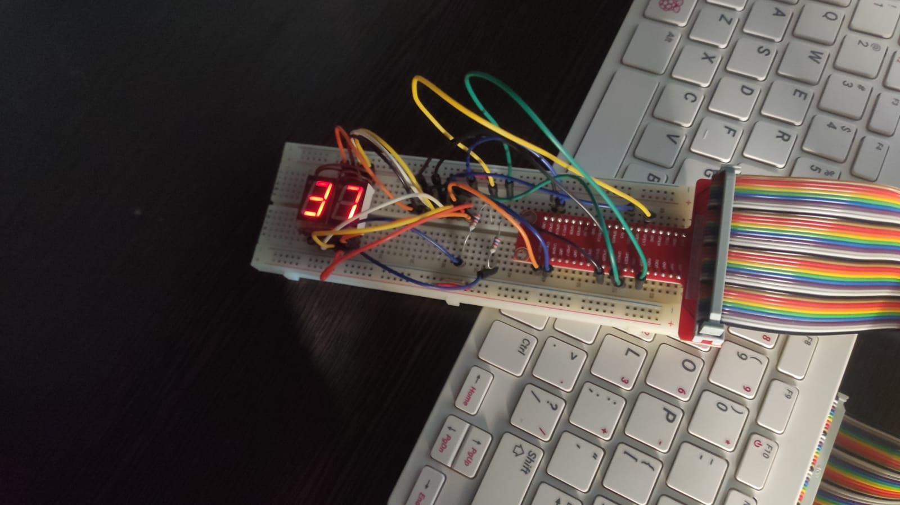

<h1 align="center">
    GPIO with Timer
</h1>

### What

This module is an extension of the `01_GPIO` module. Instead of a single display, it uses a high-resolution timer to generate a "strobe" signal that turns the cathodes on and off to multiplex the digits' signals. The digits can still be customized with the `#define` values at the top, and two cathodes are used.

`strobe_func()` is called every `STROBE_MS` milliseconds. It displays the current digit and toggles `current_digit` between 0 and 1 to alternate which display is active.

`start_strobe()` initializes and starts the high-resolution timer with the specified interval.

`stop_strobe()` safely cancels the timer when the module is removed or no longer needed.

```c
#define STROBE_MS 10
static struct hrtimer strobe_timer;
static ktime_t strobe_interval;

static enum hrtimer_restart strobe_func(struct hrtimer *t)
{
    display_digit_at(current_digit);
    // Toggle between 0 and 1
    // This is because the code is intended for two 7-seg Displays
    current_digit ^= 1;
    hrtimer_forward_now(t, strobe_interval);
    return HRTIMER_RESTART;
}

static void start_strobe(void)
{
    strobe_interval = ktime_set(0, STROBE_MS * 1e6);
    hrtimer_init(&strobe_timer, CLOCK_MONOTONIC, HRTIMER_MODE_REL);
    strobe_timer.function = strobe_func;
    hrtimer_start(&strobe_timer, strobe_interval, HRTIMER_MODE_REL);
}

static void stop_strobe(void)
{
    hrtimer_cancel(&strobe_timer);
}
```

### How

The only change is the addition of the timer, so the same commands as the previous module can be used. Now, however, two digits can be written to the device file.

```sh
./init_mod.sh mount
```

This compiles and loads the module, then creates a device file linked to the driver with `mknod`.

To send digits to the display, write directly to the device file:

```sh
echo 37 > /dev/gpio_7seg_timer
```



To remove the module and delete the device file:

```sh
./init_mod.sh clean
```
