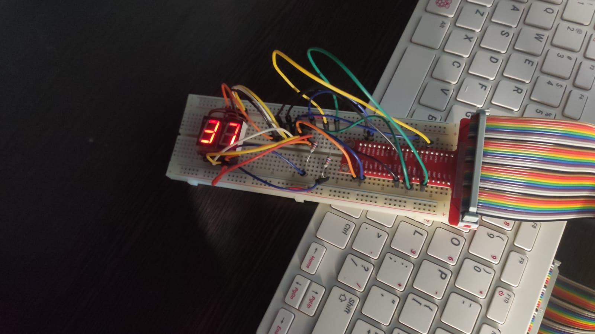

<h1 align="center">
    GPIO with DeviceTree
</h1>

### What

This driver makes use of the **Device Tree**.

*The Device Tree (`.dts` files) is a data structure used in Linux to describe the hardware layout of a system (e.g., GPIOs, buses, peripherals) in a platform-independent way. Instead of hardcoding addresses or pins in the driver, the kernel reads the `.dts` at boot, matches compatible devices, and automatically provides the driver with the resources it needs.*

Then the `.dts` file has to be compiled with `dtc`:

```sh
dtc -@ -I dts -O dtb -o gpio_7seg-overlay.dtbo device_tree.dts
```

Next, the compiled overlay must be "loaded" using the dtoverlay command and copied to a specific directory to enable hardware resources for the driver on startup:

```sh
sudo cp gpio_7seg-overlay.dtbo /boot/overlays/
sudo dtoverlay gpio_7seg-overlay
```

In this case, only the GPIOs are declared:

> [!NOTE]
> The `0` means **active-high**, while `1` means **active-low**.
> Also, this device tree is compatible with the **bcm2835** chip, which is an older SoC for Raspberry Pis. This shows that the code can be easily ported across different RPi models, making it a bit more *hardware-agnostic* compared to previous drivers.

```dts
/dts-v1/;
/plugin/;

/ {
    compatible = "brcm,bcm2835";

    fragment@0 {
        target-path = "/";
        __overlay__ {
            sevenseg {
                compatible = "arg,sevenseg";
                segment-gpios = <&gpio 24 0>,
                                <&gpio 23 0>,
                                <&gpio 20 0>,
                                <&gpio 21 0>,
                                <&gpio 22 0>,
                                <&gpio 25 0>,
                                <&gpio 19 0>;
                cathode-gpios = <&gpio 17 1>,
                                <&gpio 18 1>;
            };
        };
    };
};
```

Some parsing is required, but it’s almost magically handled when creating a **platform driver**. The `probe()` function is the one responsible for "getting" the hardware resources when we instantiate the module:

```c
/* ======== Platform driver integration ======== */

static int sevenseg_probe(struct platform_device *pdev)
{
    int ret;

    ret = setup_gpios(&pdev->dev);
    if (ret)
        return ret;

    ret = misc_register(&sevenseg_misc);
    if (ret) {
        dev_err(&pdev->dev, "Failed to register misc device: %d\n", ret);
        return ret;
    }

    start_strobe();
    dev_info(&pdev->dev, "%s: initialized (minor %d)\n", DEV_NAME, sevenseg_misc.minor);
    return 0;
}

static void sevenseg_remove(struct platform_device *pdev)
{
    stop_strobe();
    misc_deregister(&sevenseg_misc);
    dev_info(&pdev->dev, "%s: removed\n", DEV_NAME);
}
```

The driver must also declare which device tree entries it supports. That’s done using the `of_device_id` table:

```c
static const struct of_device_id sevenseg_of_match[] = {
    { .compatible = "arg,sevenseg" },
    { /* sentinel */ }
};
MODULE_DEVICE_TABLE(of, sevenseg_of_match);
```

*The **sentinel** here is simply an empty `{ }` entry marking the end of the table. The kernel iterates through the table until it finds this sentinel to know where the list ends.*

The platform driver is then registered with:

```c
static struct platform_driver sevenseg_driver = {
    .driver = {
        .name = "sevenseg",
        .of_match_table = sevenseg_of_match,
    },
    .probe = sevenseg_probe,
    .remove = sevenseg_remove,
};
```

And instead of writing our own `init` and `exit` functions, we can use this macro:

```c
module_platform_driver(sevenseg_driver);
```

This automatically generates the module’s initialization and cleanup code.

#### GPIO Setup

A slight change has to be made in the `setup_gpios()` function. Note that `devm_gpiod_get_index()` can be used in a loop. It automatically maps the **prefix** (`segment-gpios`) from the `.dts` file into the name `"segment"` inside the driver.

There is no need to manually release the GPIOs because the **device-managed (devm\_)** functions ensure automatic cleanup when the device is removed.

```c
static int setup_gpios(struct device *dev)
{
    int i, j;

    for (i = 0; i < NUM_SEGMENTS; i++) {
        segments[i] = devm_gpiod_get_index(dev, "segment", i, GPIOD_OUT_LOW);
        if (IS_ERR(segments[i])) {
            dev_err(dev, "Failed to get segment %d GPIO\n", i);
            return PTR_ERR(segments[i]);
        }
        dev_info(dev, "segment[%d] -> GPIO %d\n", i, desc_to_gpio(segments[i]));
    }

    for (j = 0; j < DISPLAYS; j++) {
        cathodes[j] = devm_gpiod_get_index(dev, "cathode", j, GPIOD_OUT_HIGH);
        if (IS_ERR(cathodes[j])) {
            dev_err(dev, "Failed to get cathode %d GPIO\n", j);
            return PTR_ERR(cathodes[j]);
        }
    }

    dev_info(dev, "All GPIOs configured successfully\n");
    return 0;
}
```

#### Auto device creation with `misc`

Instead of manually creating a character device and linking it to `/dev`, the **misc framework** in conjunction with `udev` can be used to auto-generate a `/dev/sevenseg` file.

This removes the need to:

* allocate a major number with `alloc_chrdev_region()`,
* or manually register the device.

The kernel handles it automatically.

#### Summary

By creating a `.dts` file and using a **platform driver** instead of a manual char device driver, it becomes much simpler to develop a quick hardware driver for GPIO usage. The `misc` library further streamlines the process, making the driver **cleaner, safer, and easier to port**.

### How

There are some changes in the script, but the same commands apply:

```sh
./init_mod.sh mount
```

This compiles and loads the module, then creates a device file linked to the driver with `mknod`.

To send digits to the display, write directly to the device file:

```sh
echo 37 > /dev/gpio_7seg_dts
```



To remove the module and delete the device file:

```sh
./init_mod.sh clean
```

## Resources

* [Writing a Simple misc Character Device Driver | Linux Kernel Programming Part 2 - Char Device Drivers and Kernel Synchronization](https://subscription.packtpub.com/book/cloud-and-networking/9781801079518/2/ch02lvl1sec07/writing-the-misc-driver-code-part-1)

## Extra Notes

* The command `udevadm` may be useful, the help message says: Send control commands or test the device manager.
