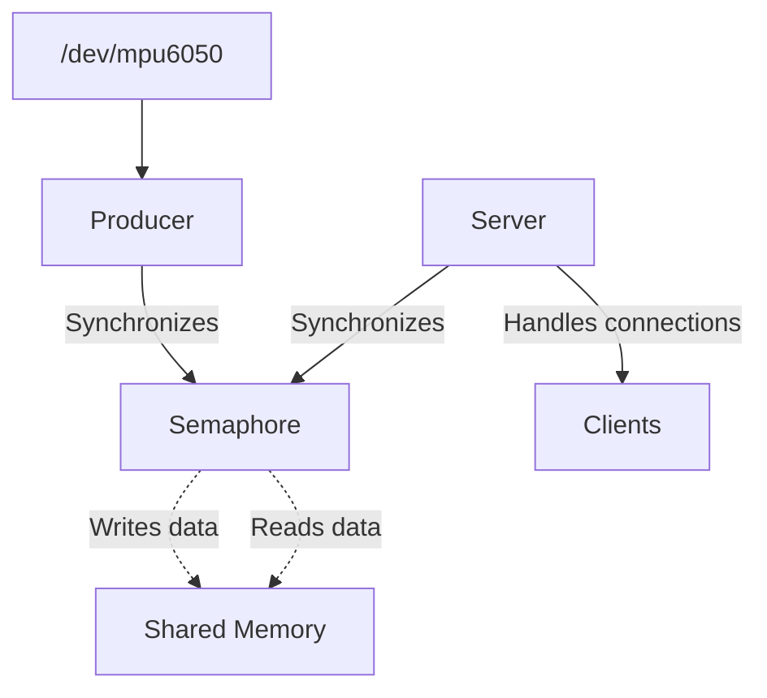

<h1 align="center">
    Simple concurrent C server
</h1>

# Why

This project demonstrates how to create a simple concurrent C server that shares data from a device (e.g., MPU6050) with multiple clients using shared memory and semaphores for synchronization.

The server reads data from the device at regular intervals and stores it in a circular buffer in shared memory. Clients can connect to the server via TCP/IP and retrieve the latest data.

It consists of two main components:

1. **Producer**: Reads data from the device and writes it to shared memory.
2. **Server**: Manages client connections and serves data from shared memory.

The idea is using pthreads for concurrent operations. Also uses signal handling to manage graceful shutdowns and avoid issues like broken pipes when clients disconnect unexpectedly. And the Producer and Server are separate programs, communicating via shared memory and semaphores.



# How

>[!IMPORTANT]
> To run this project, you need to have a working Linux Device Driver for the MPU6050 sensor, which creates the `/dev/mpu6050` device file. You can follow the instructions in the `06_I2C_w_IRQ_MPU6050` directory to set up the driver first.

The script `start.sh` compiles and runs both the producer and server in the background. You can stop them with Ctrl+C.

By default, the server listens on port `3737`. By using a web browser, you can access the live data stream at `http://<server_ip>:3737` (replace `<server_ip>` with the actual IP address of the server). It uses Server-Sent Events (SSE) to push updates to the browser in real-time.

Endpoints:

- `/`: Serves a simple HTML page that connects to the SSE endpoint and displays the data.
- `/events`: SSE endpoint that streams data updates to connected clients.
- `/json`: Returns the latest data in JSON format.

# What

This project is mainly intended for educational purposes, demonstrating inter-process communication, synchronization, and network programming in C.

Better error handling and robustness would be needed for production use. A better producer/consumer model could be implemented to avoid data loss. Even better, using a proper web server framework would be advisable for handling HTTP requests and SSE.

The shared memory and semaphore are created using POSIX APIs (`shm_open`, `sem_open`). The shared memory is structured as a circular buffer to hold multiple data entries, allowing the producer to overwrite old data when the buffer is full.

While the server is running, to check the existence of the semaphore and shared memory, you can use the following commands:

```bash
ls -la /dev/shm/sem.*
```

```bash
ls -la /dev/shm/data_buffer
```

The server uses the `select` system call to handle multiple client connections concurrently. It listens for incoming connections and data requests, sending the latest data from shared memory to connected clients.

# Resources

- [Beej's Guide to Interprocess Communication](https://beej.us/guide/bgipc/html/)
- [Producer - Consumer Problem in Multi-Threading - YouTube](https://www.youtube.com/watch?v=l6zkaJFjUbM)
- [Condition variables in C - YouTube](https://www.youtube.com/watch?v=0sVGnxg6Z3k)
- [Common multithreading problems and their fixes Part 2: Producer(s)-Consumer(s) Problem – Zephyr Project](https://www.zephyrproject.org/common-multithreading-problems-and-their-fixes-part-2-producers-consumers-problem/)
