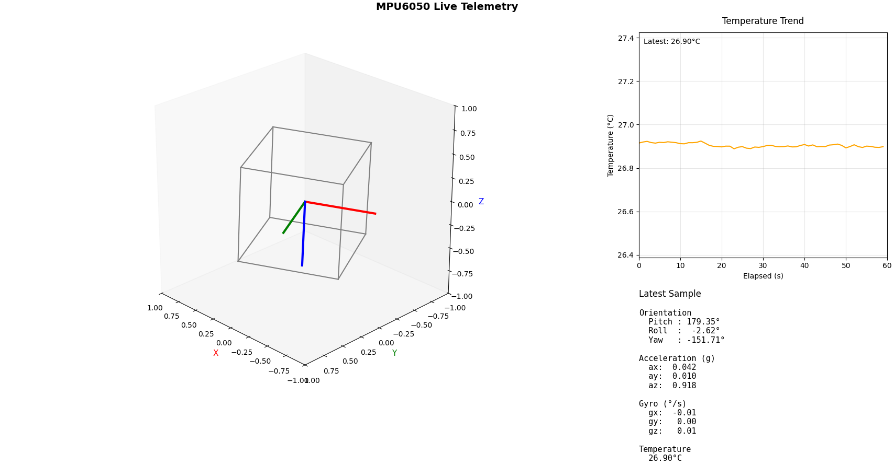

# MPU6050 Python Client

>[!WARNING]
> The code was strongly typed with the assistance of AI. It may contain errors or bad practices. Use at your own risk.

Create a virtual environment and install the `requirements.txt`.

Use Python's venv module to create a new virtual environment:

```sh
python3 -m venv venv
```

Activate the Virtual Environment:

## On Linux/Mac

```sh
source venv/bin/activate
```

## On Windows

```sh
.\venv\Scripts\activate
```

### Install Project Dependencies

Once the virtual environment is activated, install the packages specified in the `requirements.txt` file:

```sh
pip install -r requirements.txt
```

## Run the Client

Run the Python client script to connect to the C server and visualize the data:

```sh
python client.py
```

The client connects to the server at `localhost` on port `3737` by default. You can change the server address and port in the `client.py` script if needed.

The GUI window will display real-time plots of the accelerometer and gyroscope data from the MPU6050 sensor:


